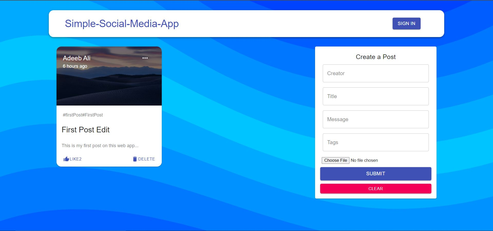
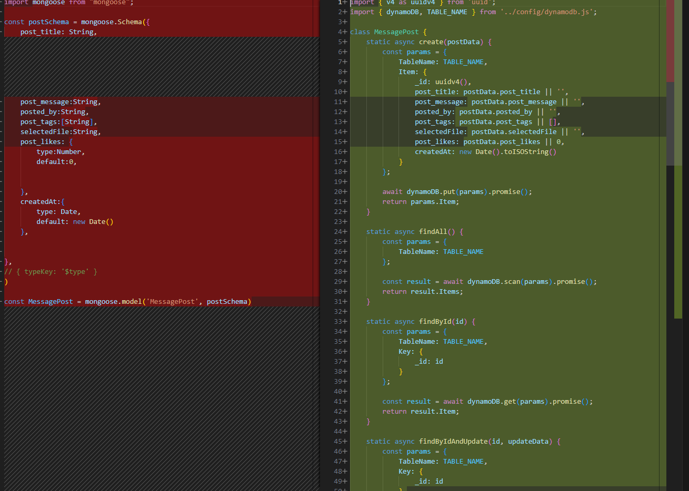
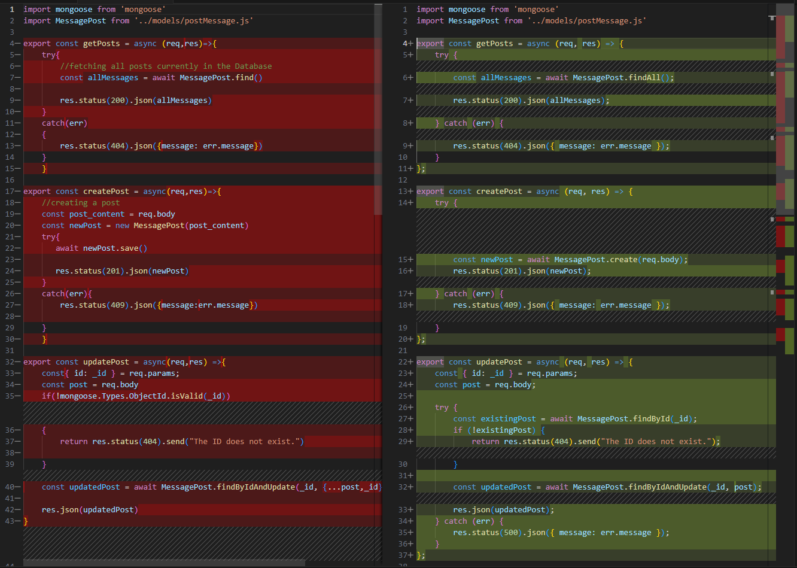
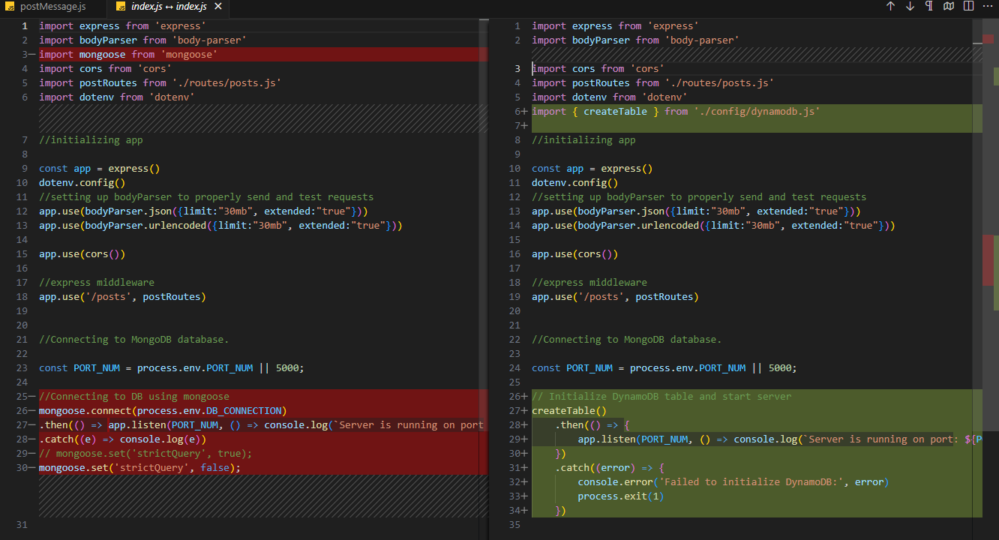

# Social Media Web Application

A full-stack social media application built with the MERN stack (MongoDB/DynamoDB, Express.js, React.js, Node.js).



## Prerequisites

Before you begin, ensure you have the following installed:

- [Node.js](https://nodejs.org/) (version 14.x or higher)
- [npm](https://www.npmjs.com/) (usually comes with Node.js)
- AWS Account (for DynamoDB)

## Setup

### 1. Clone the Repository

```bash
git clone <repository-url>
cd Social-Media-Web-App-master
```

### 2. Environment Variables

Create a `.env` file in the server directory:

```bash
# server/.env
PORT_NUM=5000
AWS_REGION=us-east-1
AWS_ACCESS_KEY_ID=your_access_key_id
AWS_SECRET_ACCESS_KEY=your_secret_access_key
```

Replace `your_access_key_id` and `your_secret_access_key` with your actual AWS credentials.

### 3. Install Dependencies

#### Server Setup

```bash
cd server
npm install
```

#### Client Setup

```bash
cd client
npm install --legacy-peer-deps
```

Note: We use `--legacy-peer-deps` due to some dependencies requiring older versions of Material-UI.

## Running the Application

### 1. Start the Server

```bash
cd server
npm start
```

The server will run on http://localhost:5000

### 2. Start the Client

```bash
cd client
npm start
```

The client application will open in your default browser at http://localhost:3000

## Features

- Create, read, update, and delete posts
- Like posts
- User authentication
- Responsive design
- Image upload support
- Real-time updates

## Architecture

- **Frontend**: React.js with Material-UI
- **Backend**: Node.js with Express.js
- **Database**: DynamoDB
- **Authentication**: JWT (JSON Web Tokens)

## API Endpoints

- `GET /posts` - Get all posts
- `POST /posts` - Create a new post
- `PATCH /posts/:id` - Update a post
- `DELETE /posts/:id` - Delete a post
- `PATCH /posts/:id/likePost` - Like a post

## Troubleshooting

1. If you see DynamoDB connection errors:

   - Verify your AWS credentials in the `.env` file
   - Check if your AWS region is correctly set
   - Ensure your AWS user has proper DynamoDB permissions

2. If the client shows connection errors:

   - Verify that the server is running on port 5000
   - Check if CORS is properly configured
   - Ensure all environment variables are set correctly

3. Material-UI version conflicts:
   - Use `npm install --legacy-peer-deps` for client installation
   - If you still see UI issues, clear npm cache and reinstall dependencies

## Contributing

1. Fork the repository
2. Create your feature branch (`git checkout -b feature/AmazingFeature`)
3. Commit your changes (`git commit -m 'Add some AmazingFeature'`)
4. Push to the branch (`git push origin feature/AmazingFeature`)
5. Open a Pull Request

# MongoDB to DynamoDB Migration Guide

## Modifying the Posts Model for DynamoDB

Replace the MongoDB schema with a DynamoDB data structure:

### Original MongoDB Schema

```javascript
// Mongoose Schema
import mongoose from "mongoose";

const postSchema = mongoose.Schema(
  {
    post_title: String,
    post_message: String,
    posted_by: String,
    post_tags: [String],
    selectedFile: String,
    post_likes: {
      type: Number,
      default: 0,
    },
    createdAt: {
      type: Date,
      default: new Date(),
    },
  }
  // { typeKey: '$type' }
);

const MessagePost = mongoose.model("MessagePost", postSchema);

export default MessagePost;
```

### New DynamoDB Implementation

```javascript
// DynamoDB Implementation
import { v4 as uuidv4 } from "uuid";
import { dynamoDB, TABLE_NAME } from "../config/dynamodb.js";

class MessagePost {
  static async create(postData) {
    const params = {
      TableName: TABLE_NAME,
      Item: {
        _id: uuidv4(),
        post_title: postData.post_title || "",
        post_message: postData.post_message || "",
        posted_by: postData.posted_by || "",
        post_tags: postData.post_tags || [],
        selectedFile: postData.selectedFile || "",
        post_likes: postData.post_likes || 0,
        createdAt: new Date().toISOString(),
      },
    };

    await dynamoDB.put(params).promise();
    return params.Item;
  }

  static async findAll() {
    const params = {
      TableName: TABLE_NAME,
    };

    const result = await dynamoDB.scan(params).promise();
    return result.Items;
  }

  static async findById(id) {
    const params = {
      TableName: TABLE_NAME,
      Key: {
        _id: id,
      },
    };

    const result = await dynamoDB.get(params).promise();
    return result.Item;
  }

  static async findByIdAndUpdate(id, updateData) {
    const params = {
      TableName: TABLE_NAME,
      Key: {
        _id: id,
      },
      UpdateExpression:
        "set post_title = :title, post_message = :message, posted_by = :author, post_tags = :tags, selectedFile = :file, post_likes = :likes",
      ExpressionAttributeValues: {
        ":title": updateData.post_title,
        ":message": updateData.post_message,
        ":author": updateData.posted_by,
        ":tags": updateData.post_tags,
        ":file": updateData.selectedFile,
        ":likes": updateData.post_likes,
      },
      ReturnValues: "ALL_NEW",
    };

    const result = await dynamoDB.update(params).promise();
    return result.Attributes;
  }

  static async findByIdAndRemove(id) {
    const params = {
      TableName: TABLE_NAME,
      Key: {
        _id: id,
      },
    };

    await dynamoDB.delete(params).promise();
  }

  static async updateLikes(id, likes) {
    const params = {
      TableName: TABLE_NAME,
      Key: {
        _id: id,
      },
      UpdateExpression: "set post_likes = :likes",
      ExpressionAttributeValues: {
        ":likes": likes,
      },
      ReturnValues: "ALL_NEW",
    };

    const result = await dynamoDB.update(params).promise();
    return result.Attributes;
  }
}

export default MessagePost;
```



## Updating Controllers for DynamoDB

Update the controllers to use our new DynamoDB model operations. The controller will maintain the same API interface but use DynamoDB operations internally.

### Original MongoDB Controllers

```javascript
import mongoose from "mongoose";
import MessagePost from "../models/postMessage.js";

export const getPosts = async (req, res) => {
  try {
    //fetching all posts currently in the Database
    const allMessages = await MessagePost.find();

    res.status(200).json(allMessages);
  } catch (err) {
    res.status(404).json({ message: err.message });
  }
};

export const createPost = async (req, res) => {
  //creating a post
  const post_content = req.body;
  const newPost = new MessagePost(post_content);
  try {
    await newPost.save();

    res.status(201).json(newPost);
  } catch (err) {
    res.status(409).json({ message: err.message });
  }
};

export const updatePost = async (req, res) => {
  const { id: _id } = req.params;
  const post = req.body;
  if (!mongoose.Types.ObjectId.isValid(_id)) {
    return res.status(404).send("The ID does not exist.");
  }
  const updatedPost = await MessagePost.findByIdAndUpdate(
    _id,
    { ...post, _id },
    { new: true }
  );

  res.json(updatedPost);
};

export const deletePost = async (req, res) => {
  const { id } = req.params;
  console.log("DELETE!!!");
  if (!mongoose.Types.ObjectId.isValid(id)) {
    return res.status(404).send("The ID does not exist.");
  }
  await MessagePost.findByIdAndRemove(id);
  res.json({ message: "Post deleted successfully" });
};

export const likePost = async (req, res) => {
  const { id } = req.params;
  if (!mongoose.Types.ObjectId.isValid(id)) {
    return res.status(404).send("The ID does not exist.");
  }
  const post = await MessagePost.findById(id);
  const updatedPost = await MessagePost.findByIdAndUpdate(
    id,
    { post_likes: post.post_likes + 1 },
    { new: true }
  );
  res.json(updatedPost);
};
```

### Updated DynamoDB Controllers

```javascript
import mongoose from "mongoose";
import MessagePost from "../models/postMessage.js";

export const getPosts = async (req, res) => {
  try {
    const allMessages = await MessagePost.findAll();
    res.status(200).json(allMessages);
  } catch (err) {
    res.status(404).json({ message: err.message });
  }
};

export const createPost = async (req, res) => {
  try {
    const newPost = await MessagePost.create(req.body);
    res.status(201).json(newPost);
  } catch (err) {
    res.status(409).json({ message: err.message });
  }
};

export const updatePost = async (req, res) => {
  const { id: _id } = req.params;
  const post = req.body;

  try {
    const existingPost = await MessagePost.findById(_id);
    if (!existingPost) {
      return res.status(404).send("The ID does not exist.");
    }

    const updatedPost = await MessagePost.findByIdAndUpdate(_id, post);
    res.json(updatedPost);
  } catch (err) {
    res.status(500).json({ message: err.message });
  }
};

export const deletePost = async (req, res) => {
  const { id } = req.params;

  try {
    const existingPost = await MessagePost.findById(id);
    if (!existingPost) {
      return res.status(404).send("The ID does not exist.");
    }

    await MessagePost.findByIdAndRemove(id);
    res.json({ message: "Post deleted successfully" });
  } catch (err) {
    res.status(500).json({ message: err.message });
  }
};

export const likePost = async (req, res) => {
  const { id } = req.params;

  try {
    const post = await MessagePost.findById(id);
    if (!post) {
      return res.status(404).send("The ID does not exist.");
    }

    const updatedPost = await MessagePost.updateLikes(
      id,
      (post.post_likes || 0) + 1
    );
    res.json(updatedPost);
  } catch (err) {
    res.status(500).json({ message: err.message });
  }
};
```



## Updating Server Configuration

Update the server's main index.js file to remove MongoDB-specific code and add DynamoDB initialization.

### Original Server Configuration

```javascript
import express from "express";
import bodyParser from "body-parser";
import mongoose from "mongoose";
import cors from "cors";
import postRoutes from "./routes/posts.js";
import dotenv from "dotenv";
//initializing app

const app = express();
dotenv.config();
//setting up bodyParser to properly send and test requests
app.use(bodyParser.json({ limit: "30mb", extended: "true" }));
app.use(bodyParser.urlencoded({ limit: "30mb", extended: "true" }));

app.use(cors());

//express middleware
app.use("/posts", postRoutes);

//Connecting to MongoDB database.

const PORT_NUM = process.env.PORT_NUM || 5000;

//Connecting to DB using mongoose
mongoose
  .connect(process.env.DB_CONNECTION)
  .then(() =>
    app.listen(PORT_NUM, () =>
      console.log(`Server is running on port : ${PORT_NUM}`)
    )
  ) // returning a promise.
  .catch((e) => console.log(e));
// mongoose.set('strictQuery', true);
mongoose.set("strictQuery", false);
```

### Updated Server Configuration for DynamoDB

```javascript
import express from "express";
import bodyParser from "body-parser";
import cors from "cors";
import postRoutes from "./routes/posts.js";
import dotenv from "dotenv";
import { createTable } from "./config/dynamodb.js";

//initializing app

const app = express();
dotenv.config();
//setting up bodyParser to properly send and test requests
app.use(bodyParser.json({ limit: "30mb", extended: "true" }));
app.use(bodyParser.urlencoded({ limit: "30mb", extended: "true" }));

app.use(cors());

//express middleware
app.use("/posts", postRoutes);

//Connecting to MongoDB database.

const PORT_NUM = process.env.PORT_NUM || 5000;

// Initialize DynamoDB table and start server
createTable()
  .then(() => {
    app.listen(PORT_NUM, () =>
      console.log(`Server is running on port: ${PORT_NUM}`)
    );
  })
  .catch((error) => {
    console.error("Failed to initialize DynamoDB:", error);
    process.exit(1);
  });
```



## Environment Configuration

Create a .env file to store the AWS credentials required for DynamoDB:

```
AWS_REGION=us-east-1
AWS_ACCESS_KEY_ID=your_access_key_id
AWS_SECRET_ACCESS_KEY=your_secret_access_key
PORT_NUM=5000
```

## License

This project is licensed under the MIT License - see the LICENSE file for details
