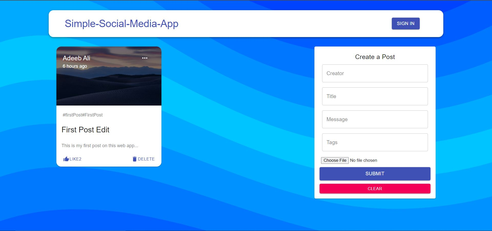

# Social Media Web Application

A full-stack social media application built with the MERN stack (MongoDB/DynamoDB, Express.js, React.js, Node.js), intended to be use on a AWS EC2 instance, connected to a AWS RDS MySQL server and a S3 bucket/buckets.



## Setup

### 1. Clone the Repository

```bash
git clone <repository-url>
cd Social-Media-Web-App-master
```

### 2. Environment Variables

Supply the `credentials.js` file in the project's root directory with your EC2 instance and RDS Mysql's credentials :

```bash
# ./credentials.js
export const DB_HOST = <YOUR_DATABASE_HOST>;
export const DB_USER = <YOUR_DATABASE_USERNAME>;
export const DB_PASSWORD = <YOUR_DATABASE_PASSWORD>;
export const DB_NAME = <YOUR_DATABASE_TABLE_NAME>;
export const EC2_URL = 'http://<YOUR_EC2_PUBLIC_IP:YOUR_EC2_PUBLIC_PORT>/posts' <>;
```

### 3. Install Dependencies

#### Server Setup

```bash
cd server
npm install
```

#### Client Setup

```bash
cd client
npm install --legacy-peer-deps
```

Note: We use `--legacy-peer-deps` due to some dependencies requiring older versions of Material-UI.

## Running the Application

### 1. Start the Server

```bash
cd server
npm start
```

### 2. Start the Client

```bash
cd client
npm start
```

## Features

- Create, read, update, and delete posts
- Like posts
- User authentication
- Responsive design
- Image upload support
- Real-time updates

## Architecture

- **Frontend**: React.js with Material-UI
- **Backend**: Node.js with Express.js
- **Database**: DynamoDB
- **Authentication**: JWT (JSON Web Tokens)

## API Endpoints

- `GET /posts` - Get all posts
- `POST /posts` - Create a new post
- `PATCH /posts/:id` - Update a post
- `DELETE /posts/:id` - Delete a post
- `PATCH /posts/:id/likePost` - Like a post

## License

This project is licensed under the MIT License - see the LICENSE file for details
